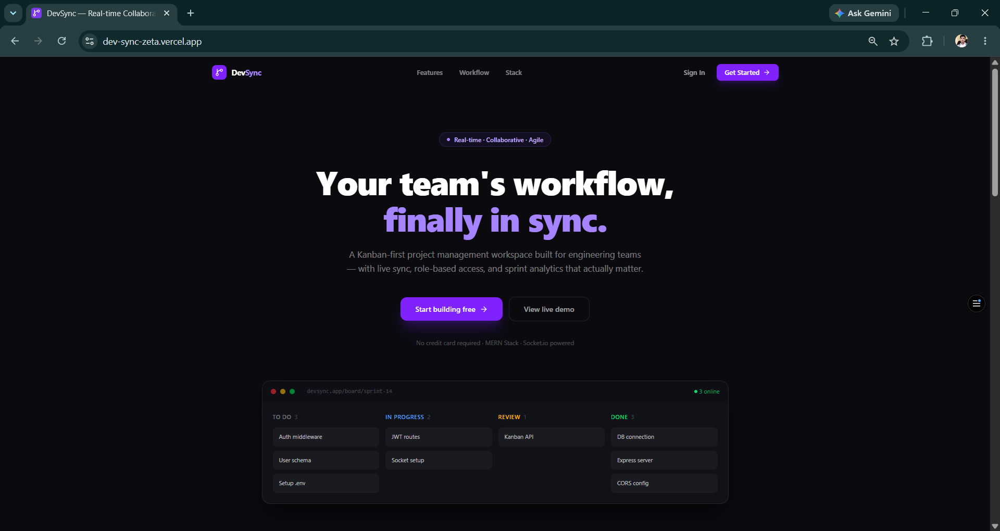
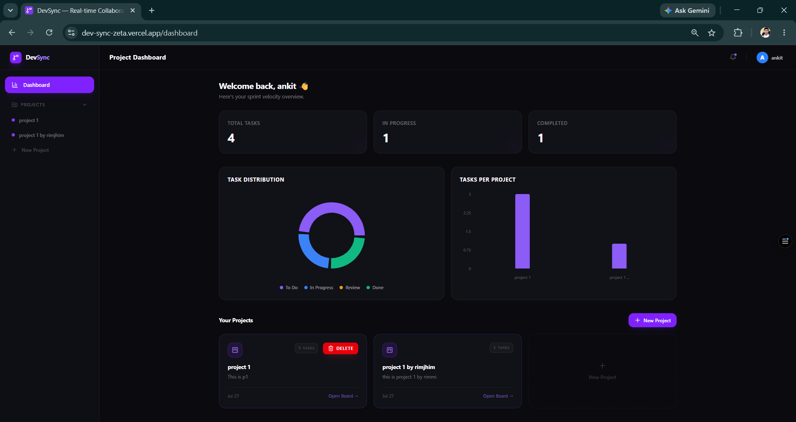
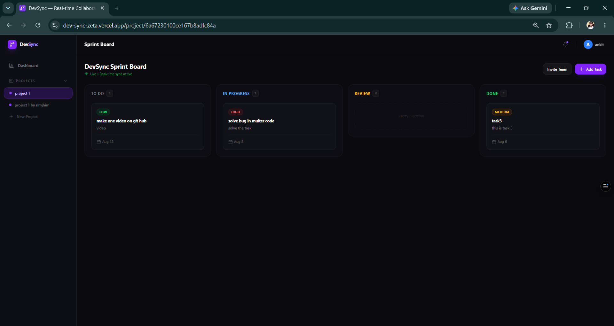

# DevSync — Real-time Collaborative Project Management Tool

A full-stack MERN application for agile teams to manage sprints with real-time collaboration, Kanban boards, and analytics.

🔗 **Live Demo**: [https://dev-sync-zeta.vercel.app](https://dev-sync-zeta.vercel.app)

---

## Features

- **Real-time Kanban Board** — Drag & drop tasks across columns (To Do, In Progress, Review, Done) with instant sync via Socket.io
- **Role-Based Access Control** — Owner can create tasks, invite members, and delete projects; Members can only move tasks
- **Team Invite System** — Add members by email; sidebar and dashboard update instantly without refresh
- **Analytics Dashboard** — Task distribution donut chart and tasks-per-project bar chart powered by Recharts
- **JWT Authentication** — Secure login/register with bcrypt password hashing
- **Mobile Optimized** — Tab-based layout with "Move To" bottom sheet for mobile users
- **Real-time Notifications** — Instant alerts for project invite, task updates, and project deletion

---
## Screenshots





---

## Tech Stack

| Layer | Technology |
|---|---|
| Frontend | React.js, Tailwind CSS, Recharts, @dnd-kit |
| Backend | Node.js, Express.js |
| Database | MongoDB, Mongoose |
| Real-time | Socket.io |
| Auth | JWT, bcryptjs |

---

## Getting Started

### Prerequisites
- Node.js v18+
- MongoDB (local or Atlas)

### Installation

**1. Clone the repo**
```bash
git clone https://github.com/Rajat4007/devsync.git
cd devsync
```

**2. Backend setup**
```bash
cd backend
npm install
```

Create a `.env` file in the `backend` folder:
```env
MONGO_URI=your_mongodb_connection_string
JWT_SECRET=your_jwt_secret_key
JWT_EXPIRES_IN=7d
PORT=3000
```

```bash
npm run dev
```

**3. Frontend setup**
```bash
cd frontend
npm install
```

Create a `.env` file in the `frontend` folder:
```env
VITE_API_BASE_URL=https://devsync-production-aa31.up.railway.app
```

```bash
npm run dev
```

Frontend runs on `http://localhost:5173` and backend on `http://localhost:3000`.

> For production, frontend is deployed on [Vercel](https://dev-sync-zeta.vercel.app) and backend on [Railway](https://devsync-production-aa31.up.railway.app).

---

## Project Structure

```
devsync/
├── backend/
│   ├── config/         # Database connection
│   ├── controllers/    # Route handlers
│   ├── middleware/     # Auth & role middleware
│   ├── models/         # Mongoose schemas
│   ├── routes/         # API routes
│   └── server.js       # Entry point + Socket.io
├── frontend/
│   ├── src/
│   │   ├── components/ # Sidebar, Navbar
│   │   ├── context/    # AuthContext, ThemeContext
│   │   ├── hooks/      # Custom hooks
│   │   ├── pages/      # Landing, Dashboard, KanbanBoard, Login, Profile, Register, Setting
│   │   └── App.jsx
│   └── public/
└── README.md
```

---

## API Endpoints

### Auth
| Method | Endpoint | Description |
|---|---|---|
| POST | `/api/auth/register` | Register new user |
| POST | `/api/auth/login` | Login and get JWT |

### Projects
| Method | Endpoint | Description |
|---|---|---|
| GET | `/api/projects` | Get all user projects |
| POST | `/api/projects` | Create new project |
| GET | `/api/projects/:id` | Get project by ID |
| DELETE | `/api/projects/:id` | Delete project (owner only) |
| POST | `/api/projects/:id/invite` | Invite member by email |

### Tasks
| Method | Endpoint | Description |
|---|---|---|
| GET | `/api/tasks/project/:id` | Get all tasks for a project |
| POST | `/api/tasks` | Create new task |
| PUT | `/api/tasks/:id` | Edit task |
| PUT | `/api/tasks/:id/status` | Update task status |
| DELETE | `/api/tasks/:id` | Delete task |

---

## Socket.io Events

| Event | Direction | Description |
|---|---|---|
| `join-project` | Client → Server | Join project room |
| `join-user` | Client → Server | Join personal room |
| `task-moved` | Client → Server | Task status changed |
| `task-created` | Client → Server | New task created |
| `task-edited` | Client → Server | Task edited |
| `task-deleted` | Client → Server | Task deleted |
| `task-updated` | Server → Client | Broadcast task move |
| `task-added` | Server → Client | Broadcast new task |
| `project-deleted` | Server → Client | Broadcast project delete |
| `project-removed` | Server → Client | Remove from dashboard |
| `project-added` | Server → Client | Add to sidebar on invite |

---

## Author

**Ankit Kumar Rajak**
- GitHub: [@Rajat4007](https://github.com/Rajat4007)
- LinkedIn: [ankit-kumar-rajak](https://www.linkedin.com/in/ankit-kumar-rajak-b26509358)

---

## License

This project is open source and available under the [MIT License](LICENSE).